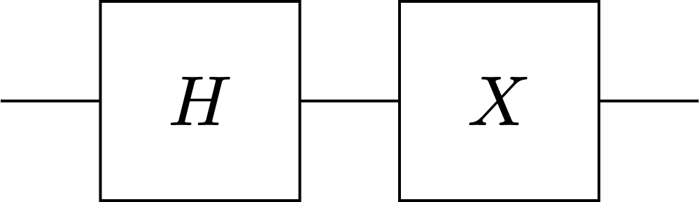
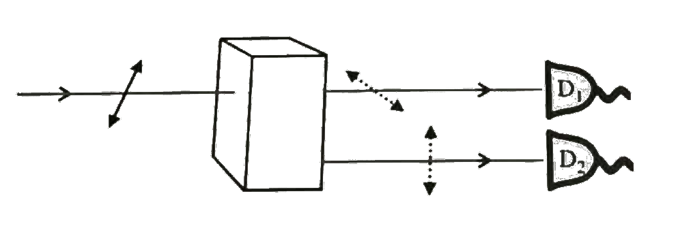

# 2019 简量期末

  by <a href="https://github.com/zhuozhiyongde"> Arthals</a>
   
  blog: <a href="https://arthals.ink">Arthals' ink</a>

1. 原子里有着许多轨道量子态。按能量从低到高它们分别是 1s, 2s, 2p 等。锂原子有 3 个电子，将这 3 个电子放到 1s，2s 这 2 个轨道量子态

    1. 请问共有多少种放法？（注意：由于电子有自旋，一个轨道量子态可以同时放 2 个电子：1 个自旋向上的电子和 1 个自旋向下的电子）
    1. 其中能量最低的放法是怎样的？（假设电子能量和它的自旋状态无关）
    1. 如果电子没有全同性，是可区分的，有多少种放法？
    1. 如果电子是玻色子，能量最低的放法是怎样的？

2. 在二维希尔伯特空间里有两个向量

    $$
    |\psi_1\rangle = \frac{1}{\sqrt{5}} \begin{pmatrix} 2 \\ i \end{pmatrix}, \quad |\psi_2\rangle = \frac{1}{13} \begin{pmatrix} 12i \\ 5 \end{pmatrix}
    $$

    计算 $\langle \psi_1|\psi_2 \rangle$。

3. 现在有两个矩阵

    $$
    M_1 = \begin{pmatrix} 3 & 1+i \\ 1-i & -2 \end{pmatrix}, \quad M_2 = \begin{pmatrix} 2 & 2i \\ 2 & -1 \end{pmatrix}
    $$

    请回答：

    1. $M_1 M_2 = M_2 M_1$ 吗？
    1. $M_1$ 和 $M_2$ 中哪个是厄密矩阵？

4. 给定一个自旋态

    $$
    |\psi\rangle = \frac{2}{3}|u\rangle + \frac{i\sqrt{5}}{3}|d\rangle
    $$

    问测得

    1. 自旋沿 $y$ 方向向上的几率是多少？
    2. 自旋沿 $y$ 方向向下的几率是多少？

5. 回答下列问题

    1. 给定一个双自旋态 $|\Psi\rangle = \frac{1}{2}|uu\rangle + \frac{1}{2}|ud\rangle + \frac{1}{\sqrt{2}}|dd\rangle$，这是纠缠态吗？给出理由。
    1. 计算 $\langle \Psi|\hat{\sigma}_y \otimes \hat{\sigma}_z|\Psi \rangle$。

6. 有一个量子计算机程序，它只涉及一个量子比特，由两个量子逻辑门组成。先进行一个哈达玛门操作，然后进行一个 $X$ 门操作（见图）。

    

    1. 如果量子比特的输入态是 $|0\rangle$，请问输出态是什么？
    1. 如果量子比特的输入态是 $|1\rangle$，请问输出态是什么？
    1. 如果量子比特的输入态是 $(|0\rangle + |1\rangle)/\sqrt{2}$，请问输出态是什么？

7. 给定一个自旋态 $|\phi\rangle = (|u\rangle + i|d\rangle)/\sqrt{2}$

    1. 计算关于 $\sigma_y$ 测量的不确定度 $\Delta \hat{\sigma}_y^2$；
    2. 计算关于 $\sigma_x$ 测量的不确定度 $\Delta \hat{\sigma}_x^2$；
    3. 有两个自旋，自旋 1 的分量是 $\sigma_x$，自旋 2 的分量是 $\tau_y$。存在不存在一个双自旋态使得 $\Delta \hat{\sigma}_x^2$ 和 $\Delta \hat{\tau}_y^2$ 同时为零？如果存在，请写下这个自旋态。

8. 小刚测定在一个量子光学实验室做实验。他调试好了一个单光子发生器，每次发出的光子处于如下偏振态 $(|0\rangle + |1\rangle)/\sqrt{2}$。这样，如果这个光子通过一个方解石棱镜，它被探测器 1 和探测器 2 探测到的几率各是 50%。

    

    这时小刚正在犹豫，暑期是出去旅行呢？还是继续待在实验室做实验？他决定利用刚刚调试好的实验装置来帮他决定。他让单光子发生器发出一个光子：

    1. 如果探测器 1 探测到了光子，他就去旅行；
    1. 如果探测器 2 探测到了光子，他就留在实验室继续做实验。

    分別用波包塌缩理论和多世界理论来描述实验结果。
