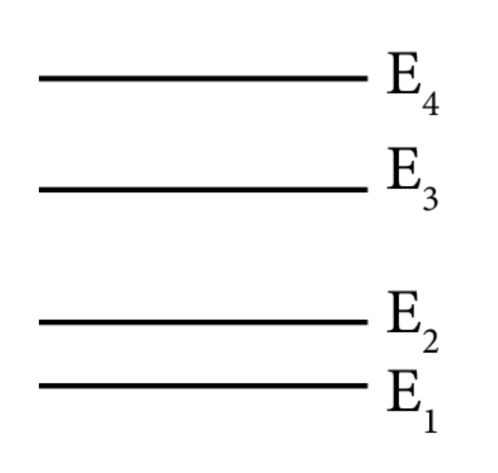
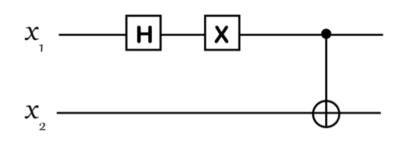

# 2020 简量期末

  by <a href="https://github.com/zhuozhiyongde"> Arthals</a>
   
  blog: <a href="https://arthals.ink">Arthals' ink</a>

1. 有 4 个能量本征态，它们的能量从低到高分别是 $E_1 < E_2 < E_3 < E_4$（见图）。锂有两种同位素 $^6\text{Li}$ 和 $^7\text{Li}$。$^6\text{Li}$ 由三个质子、三个中子、三个电子构成，是费米子；$^7\text{Li}$ 由三个质子、四个中子、三个电子构成，是玻色子。

    1. 请问把 3 个 $^6\text{Li}$ 原子放到这 4 个量子态，共有多少种放法？
    2. 对于这些 $^6\text{Li}$ 原子，其中能量最低的放法是怎样的？
    3. 请问把 3 个 $^7\text{Li}$ 原子放到这 4 个量子态，共有多少种放法？
    4. 对于这些 $^7\text{Li}$ 原子，其中能量最低的放法是怎样的？

    提示：有同学可能知道，由于锂原子最外层有一个未配对的电子，所以锂原子是具有自旋的，在某一个能级，比如 $E_2$，锂原子可以自旋向上也可以自旋向下。在考虑上面问题时，我们假设锂原子的自旋被 “冻结” 了，只能处于自旋向上的状态。物理学家可以通过强磁场来 “冻结” 锂原子的自旋。

    

2. 在二维希尔伯特空间里有两个向量

    $$
    |\psi_1\rangle = \frac{1}{3} \begin{pmatrix} 2 \\ i\sqrt{5} \end{pmatrix}, \quad |\psi_2\rangle = \frac{1}{\sqrt{3}} \begin{pmatrix} -i \\ \sqrt{2} \end{pmatrix}
    $$

    计算内积 $\langle \psi_2 | \psi_1 \rangle$。

3. 现在有两个矩阵

    $$
    M_1 = \begin{pmatrix} 2 & 1+i \\ i & -5 \end{pmatrix}, \quad M_2 = \begin{pmatrix} 2 & 2+i \\ 2-i & -3 \end{pmatrix}
    $$

    1. 计算 $M_1 M_2$ 和 $M_2 M_1$，它们相等吗？
    2. $M_1$ 和 $M_2$​ 中哪个是厄密矩阵？

4. 给定一个自旋态

    $$
    |\psi\rangle = \frac{3}{5}|u\rangle - \frac{i4}{5}|d\rangle
    $$

    问测得

    1. 自旋沿 $z$ 方向向上的几率是多少？
    2. 自旋沿 $y$ 方向向下（对应 $\hat{\sigma}_y$ 的本征值为 -1）的几率是多少？

5. 给定一个双自旋态 $|\Psi\rangle = \frac{1}{3}|uu\rangle - \frac{2i}{3}|ud\rangle + \frac{2}{3}|du\rangle$

    1. 证明它是纠缠态。
    2. 计算 $\langle\Psi|\hat{\sigma}_x \otimes \hat{\tau}_y|\Psi\rangle$。

6. 有一个量子计算机程序，它作用在两个量子比特 $x_1$ 和 $x_2$ 上，由三个量子逻辑门组成：先进行一个哈达玛门操作，然后进行一个 $X$ 门操作，最后是一个 $CNOT$ 门。我们用 $|x_2, x_1\rangle$ 表示两个量子比特的状态，比如 $|01\rangle$ 表示第一个量子比特 $x_1$ 处于状态 $|1\rangle$，第二个量子比特 $x_2$ 处于状态 $|0\rangle$​。

    

    1. 如果输入态是 $|00\rangle$，请问输出态是什么？
    2. 如果输入态是 $|01\rangle$，请问输出态是什么？
    3. 如果输入态是 $(3|00\rangle + 4i|01\rangle)/5$，请问输出态是什么？

7. 给定一个自旋态 $|\phi\rangle = \frac{(2|u\rangle + i|d\rangle)}{\sqrt{5}}$

    1. 计算关于 $\hat{\sigma}_y$ 测量的不确定度 $\Delta \hat{\sigma}_y^2$；
    2. 计算关于 $\hat{\sigma}_z$ 测量的不确定度 $\Delta \hat{\sigma}_z^2$；
    3. 它们满足 $\Delta \hat{\sigma}_y^2 + \Delta \hat{\sigma}_z^2 \geq 1$​ 吗？

8. 宇宙射线包含各种高能量的粒子，比如质子，$\alpha$ 粒子，电子等。它们和 DNA 相互作用后可能导致某些基因发生突变。在很久以前有一只类鹿的动物，它生殖细胞中的 DNA 和宇宙射线中的某个粒子有了这么一次遭遇。这个粒子由于来自一颗遥远的恒星，在飞行了几十光年到达地球时，它的波函数已经远远宽于地球的直径。这时候，我们关心的系统的波函数大致可以写成
    $$
    |\Psi_0\rangle = (a|\psi_1\rangle + b|\psi_2\rangle) \otimes |\Phi^0_{DNA}\rangle
    $$
    这里 $|\psi_1\rangle$ 表示和 DNA 在空间上没有重叠的粒子波函数，$|\psi_2\rangle$ 表示和 DNA 重叠的粒子波函数；$|\Phi^0_{DNA}\rangle$ 是描述还没有变异 DNA 的波函数。由于粒子的波函数非常宽，它和 DNA 的重叠部分很小，所以 $|a|^2 \gg |b|^2$。粒子和 DNA 相互作用后，波函数会变成
    $$
    |\Psi_f\rangle = a|\psi_1\rangle \otimes |\Phi^0_{DNA}\rangle + b|\psi_2\rangle \otimes |\Phi^m_{DNA}\rangle
    $$
    由于 $|\psi_1\rangle$ 和 DNA 在空间上没有重叠，它不会让 DNA 发生任何变化；$|\psi_2\rangle$ 和 DNA 在空间上重叠，它会导致 DNA 发生突变。假设这个突变的基因会让那只类鹿动物长出角来。分别用波包塌缩理论和多世界理论来描述这个宇宙射线粒子和 DNA 作用的后果。
