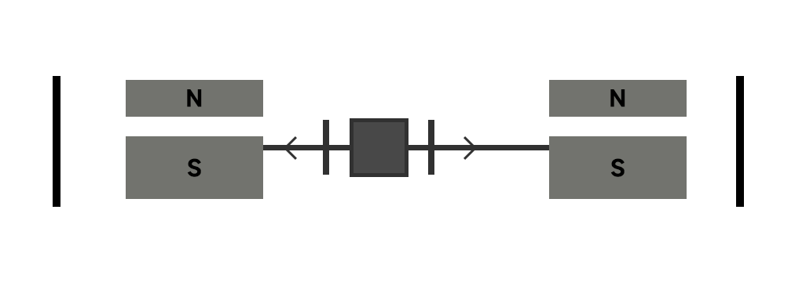
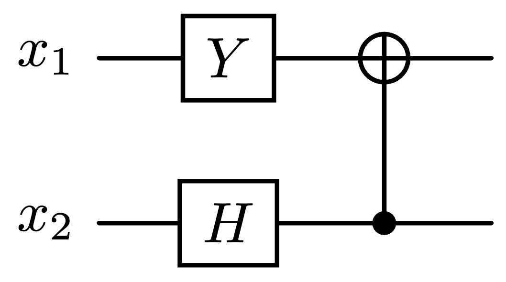

# 2021 简量期末

  by <a href="https://github.com/zhuozhiyongde"> Arthals</a>
   
  blog: <a href="https://arthals.ink">Arthals' ink</a>

1. 请选出正确的选项

    1. 量子计算机能快速破解所有密码
    2. 现在已经有超越经典算法的量子算法
    3. 对于任何计算问题，都有比经典算法更快的量子算法
    4. 量子通信技术可以安全地分发维南密码

2. 下面哪些技术是隐性量子技术？

    1. 量子计算机
    2. 量子点显示器
    3. 激光打印机
    4. 量子中医

3. 请选出正确的选项

    1. 电子是全同费米子
    2. 氦元素有两种同位素，氦 4 和氦 3。氦 4 原子和氦 3 原子是全同的。
    3. 氦 4 原子是全同费米子
    4. 光子是全同费米子

    注：一个氦 4 原子由两个质子，两个中子，两个电子组成；一个氦 3 原子由两个质子，一个中子，两个电子组成。

4. 在下图的双施特恩 - 盖拉赫实验中，一个自旋向左飞行，一个自旋向右飞行，双自旋处于纠缠态 $|S_3\rangle$​，选出正确的表述。

    $$
    |S_3\rangle = \frac{1}{\sqrt{2}}(|ud\rangle + |du\rangle)
    $$

    

    1. 假设两边的磁场都是沿 $z$ 方向。如果左边自旋在检测屏上方产生一个斑点，那么右边自旋在检测屏下方产生一个斑点。
    2. 如果左边磁场沿 $\vec{n} = (7/25, 0, -24/25)$ 方向，那么左边检测屏上的两个斑点大小不同。
    3. 图中右边磁场离粒子源更远，测量完成得更晚，所以右边的测量结果会受左边测量结果的影响。
    4. 下方假设两边的磁场沿同一个方向（但不是 $z$ 方向）。如果左边自旋在检测屏下方产生一个斑点，那么右边自旋在检测屏上方产生一个斑点。

5. 利用弗雷德金门（Fredkin gate）实现经典与非门。

6. 在二维希尔伯特空间里有两个向量

    $$
    |\psi_1\rangle = \frac{1}{17}\begin{pmatrix}15\\-i8\end{pmatrix}, \quad |\psi_2\rangle = \frac{1}{3}\begin{pmatrix}i\\2\sqrt{2}\end{pmatrix}
    $$

    计算内积 $\langle\psi_2|\psi_1\rangle$。

7. 现在有两个矩阵

    $$
    M_1 = \begin{pmatrix}3 & 1+2i \\ 2-i & -7\end{pmatrix}, \quad M_2 = \begin{pmatrix}1 & 1-3i \\ 1+3i & -1\end{pmatrix}
    $$

    1. 计算 $M_1 M_2$ 和 $M_2 M_1$，它们相等吗？
    2. $M_1$ 和 $M_2$ 中哪一个是厄米矩阵？

8. 给定一个自旋态

    $$
    |\psi\rangle = \frac{2}{3}|u\rangle - \frac{i\sqrt{5}}{3}|d\rangle
    $$

    1. 自旋沿 $z$ 方向向上的几率是多少？
    2. 自旋沿 $y$ 方向向上 （对应 $\hat{\sigma}_{y}$ 的本征值为 1） 的几率是多少？

9. 给定一个双自旋态

    $$
    |\Psi\rangle=\frac35\left|uu\right\rangle-\frac{2\sqrt{2}}5i\left|ud\right\rangle+\frac{2\sqrt{2}}5\left|dd\right\rangle
    $$

    计算 $\langle\Psi|\hat{\sigma}_y\otimes\hat{\tau}_x|\Psi\rangle$

10. 有一个量子计算程序，它作用在两个量子比特的 $x_1$ 和 $x_2$ 上。由三个量子逻辑门组成。先对 $x_1,x_2$​​ 分别进行一个 Y 门操作和一个哈达玛门操作最后是一个 CNOT 门 （见图）。我们用 $|x_1,x_2\rangle$ 表示两个量子比特的状态，比如 $|01\rangle$ 表示第一个量子比特 $x_1$ 处于状态 $|0\rangle$，第二个量子比特 $x_2$ 处于状态 $|1\rangle$。

    

    1. 如果输入态是 $|00\rangle$，请问输出态是什么？
    2. 如果输入态是 |$11\rangle$，请问输出态是什么？输出态是纠缠态吗？如果是，请证明。
    3. 如果输入态是 $\frac{4}{5}|00\rangle - \frac{3}{5}i|11\rangle$，请问输出态是什么？

11. 给定一个自旋态 $|\phi\rangle = \frac{5}{13}|u\rangle - i\frac{12}{13}|d\rangle$

    1. 计算关于 $\hat{\sigma}_z$ 测量的测量的不确定度 $\Delta\hat{\sigma}_z^2$。
    2. 计算关于 $\hat{\sigma}_x$ 测量的测量的不确定度 $\Delta\hat{\sigma}_x^2$。
    3. 有两个自旋，对自旋 1 我们测量它的 $x$ 分量，即 $\hat{\sigma}_x$；对自旋 2 我们测量它的 $y$ 分量是 $\hat{\tau}_y$。存不存在一个双自旋态使得 $\Delta\hat{\sigma}_x^2$ 和 $\Delta\hat{\tau}_y^2$ 同时为零？如果存在，请写下这个自旋态。
