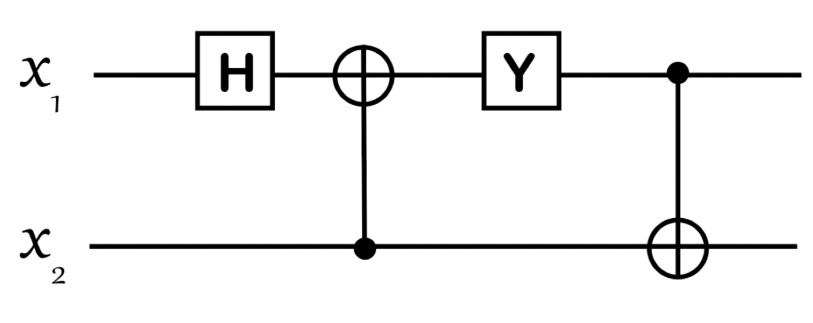

# 2022 简量期末

  by <a href="https://github.com/zhuozhiyongde"> Arthals</a>
   
  blog: <a href="https://arthals.ink">Arthals' ink</a>

1. 下面哪些关于量子力学史的表述是正确的？

    1. 普朗克最早提出光是粒子
    2. 爱因斯坦最早将量子理论用来解释固体的比热
    3. 爱因斯坦对新量子理论的建立没有任何贡献
    4. 玻尔成功地利用量子力学解释了元素周期表

2. 下面哪些技术是隐性量子技术

    1. 量子基金
    2. 量子通信
    3. 手机芯片
    4. 核磁共振影像技术

3. 请选出正确的选项

    1. 氦 3 原子是全同费米子
    2. 氢元素有两种同位素，氘和氚氘是氚的全同粒子
    3. 光子是全同玻色子
    4. 质子是全同玻色子

    注：一个氦 3 原子由两个质子，一个中子，两个电子组成

4. 请选出正确的选项

    1. 量子力学中的波可以由一个粒子构成
    2. 波函数是可以直接观测的
    3. 电子没有大小
    4. 苹果有大小，所以构成苹果的基本粒子必须具有大小

5. 请选出正确的选项

    1. 量子计算机能破 RSA 密码
    2. 对于任何计算问题，都有比经典算法更快的量子算法
    3. 可逆经典计算机是量子计算机的一个特例
    4. 在量子隐形传态中，传递的经典信息中包含了部分需要传递的量子信息

6. 请选出正确的选项

    1. 海森堡不确定性关系的根源是量子测量对被测量物体带来的不可避免的扰动
    2. 贝尔不等式表明量子纠缠中的超距关联和经典超距关联是不一样的
    3. 经典测量中，仪器对测量物体的扰动在原则上是不可忽略的
    4. 退相干是建造量子计算机时需要克服的技术难题

7. 利用托福利门 (Toffoli gate) 实现经典与非门

8. 在二维希尔伯特空间里有两个向量

    $$
    |\psi_1\rangle = \frac{1}{13} \begin{pmatrix} 5 \\ 12i \end{pmatrix}, \quad |\psi_2\rangle = \frac{1}{5} \begin{pmatrix} -i4 \\ 3 \end{pmatrix}
    $$

    计算内积 $\langle \psi_2 | \psi_1 \rangle$

9. 给定一个自旋态

    $$
    |\psi\rangle = \frac{8}{17}|u\rangle - \frac{15}{17}i|d\rangle
    $$

    问测得

    1. 自旋沿 $z$​ 方向向上的几率是多少
    2. 自旋沿 $x$​ 负方向 （对应 $\hat{\sigma}_x$​ 的本征值为 -1） 的几率是多少？

10. 现在有两个矩阵

    $$
    M_1 = \begin{pmatrix} 5 & 2 + i \\ 2 - i & -2 \end{pmatrix}, \quad M_2 = \begin{pmatrix} -3 & 3 - 2i \\ 2 + 3i & 1 \end{pmatrix}
    $$

    1. 计算 $M_1 M_2$​​ 和 $M_2 M_1$​​，它们相等吗？
    1. $M_1$​ 和 $M_2$​​​ 中哪个是厄密矩阵？

11. 有一个量子计算机程序，它作用在两个量子比特 $x_1$ 和 $x_2$ 上，由四个量子逻辑门组成：第一个是哈达玛门操作，第二个是 CNOT 门，第三个是 Y 门操作，最后是一个 CNOT 门（见图）。我们用 $\lvert x_1, x_2 \rangle$ 表示两个量子比特的状态，比如 $\lvert 01 \rangle$ 表示第一个量子比特 $x_1$ 处于状态 $\lvert 0 \rangle$，第二个量子比特 $x_2$ 处于状态 $\lvert 1 \rangle$。

    

    1. 如果输入态是 $\lvert 01 \rangle$，请问输出态是什么？
    1. 如果输入态是 $\lvert 10 \rangle$，请问输出态是什么？输出态是纠缠态吗？如果是，请证明。
    1. 如果输入态是 $(4 \lvert 10 \rangle - 3i \lvert 01 \rangle)/5$​，请问输出态是什么？

12. 给定一个自旋态 $\lvert \phi \rangle = \frac{3}{5} \lvert u \rangle - \frac{4}{5} i \lvert d \rangle$

    1. 计算关于 $\hat{\sigma}_y$ 测量的不确定度 $\Delta \sigma_y^2$；
    2. 计算关于 $\hat{\sigma}_x$ 测量的不确定度 $\Delta \sigma_x^2$；
    3. 对于一个双自旋系统，对自旋 1 我们测量它的 $x$ 分量，即 $\sigma_x$；对自旋 2 我们测量它的分量是 $\hat{\tau}_y$。存不存在一个双自旋态使得 $\Delta \sigma_x^2$ 和 $\Delta \hat{\tau}_y^2$ 同时为零？如果存在，请写下这个自旋态。

13. 在下图的双施特恩 - 盖拉赫实验中双自旋处于如下量子态

    $$
    \lvert \Psi \rangle = \frac{3}{5} \lvert uu \rangle - \frac{2\sqrt{2}}{5} \lvert du \rangle + \frac{2\sqrt{2}}{5} i \lvert dd \rangle,
    $$

    

    1. 计算 $\langle \Psi \lvert \hat{\sigma}_z \otimes \hat{\tau}_y \rvert \Psi \rangle$；
    2. 假设两边的磁场都是沿 $z$ 方向，列出所有可能的测量结果；
    3. 假设左边的磁场是沿 $z$ 方向，右边的磁场是沿 $x$ 方向，粒子源发射 1000 对这样的自旋，那么左边检测屏上两个斑点各有大约多少粒子？
