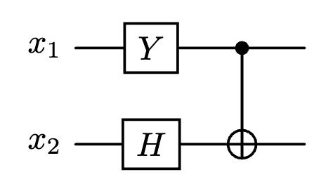
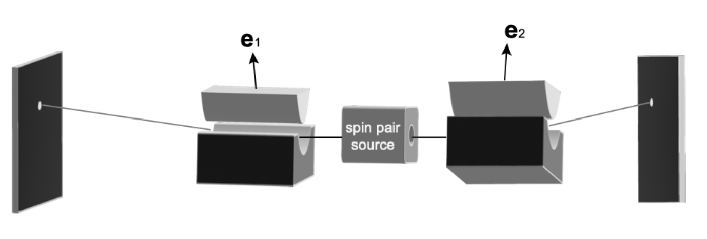

# 2024 简量期末

  by <a href="https://github.com/zhuozhiyongde"> Arthals</a> / 夏日晴空 / 鲸岛
   
  blog: <a href="https://arthals.ink">Arthals' ink</a>

1. 请选出正确的选项

   1. 玻色在写给爱因斯坦的第一封信里明确表明光子是全同粒子
   2. 德布罗意利用波粒二象性成功解释了氢原子的光谱
   3. 埃弗里特提出的多世界理论得到了玻尔的支持
   4. 旧量子理论可以成功解释氢分子的光谱

2. 请选出正确的选项

   1. 量子通信
   2. 半导体芯片
   3. 量子波动阅读
   4. 核磁共振成像

3. 请选出正确的选项

   1. 质子是费米子
   2. 氢原子是玻色子
   3. 光子是玻色子
   4. 电子是玻色子

   注：一个氢原子由一个质子和一个电子组成。

4. 请选出正确的选项

   1. 电子没有大小
   2. 氢原子的体积等于质子的体积加上电子的体积
   3. 只有量子纠缠态是能被克隆的，量子直积态可以被克隆
   4. 在电子双缝干涉实验中，每一个电子都同时通过了两条缝

5. 请选出正确的选项

   1. 量子隐形传态利用了量子纠缠，因此可以超光速
   2. 经典通信不可以传递量子信息
   3. BB84 是一种分发密码的量子通信方案
   4. 量子信息的载体可以不是光子

6. 请选出正确的选项

   1. 退相干曾经是建造经典计算机时碰到过的技术困难
   2. 量子计算机只有一个普适逻辑门
   3. 弗雷德金门是可逆经典计算机的普适逻辑门
   4. 量子计算机能快速破解 RSA 密码

7. 请选出正确的选项

   1. 对于一副手套，左手套和右手套之间的关联是量子纠缠
   2. 所有的经典关联都不是超距的
   3. 量子纠缠违反贝尔不等式否定了隐变量理论
   4. 当自旋 1 和自旋 2 纠缠时，自旋 1 不再具有确定的自旋态

8. 请选出正确的选项

   1. 海森堡不确定性关系的根源是矩阵乘法的不可交换性
   2. 根据多世界理论，地球现在处于多个状态的叠加，在某些状态中地球上还没有生命
   3. 波包塌缩是一种幺正变换
   4. 对于一个质量 1 千克的宏观物体，它的所有性质可以用经典物理解释

9. 在二维希尔伯特空间里有两个向量
    $$
    |\psi_1\rangle = \frac{1}{5} \begin{pmatrix} 3i \\ 4 \end{pmatrix}, \quad |\psi_2\rangle = \frac{1}{5} \begin{pmatrix} 4 \\ 3i \end{pmatrix}, \quad |\psi_3\rangle = \frac{1}{17} \begin{pmatrix} 15 \\ 8i \end{pmatrix}
    $$

    1. 计算内积 $\langle \psi_1 | \psi_2 \rangle$ 与 $\langle \psi_1 | \psi_3 \rangle$
    2. 判断哪两个量子态相互正交

10. 给定一个自旋态

    $$
    |\psi\rangle = \frac{7}{25}|u\rangle - \frac{24}{25}i|d\rangle
    $$

    问测得

    1. 自旋沿 $z$​ 方向向上的几率是多少？
    2. 自旋沿 $x$​ 负方向 （对应 $\hat{\sigma}_x$​ 的本征值为 -1） 的几率是多少？

11. 现在有两个矩阵

    $$
     M_1 = \begin{pmatrix} 1 & 1 + i \\ 1 - i & -4 \end{pmatrix}, \quad
     M_2 = \begin{pmatrix} 3 & 2 - 2i \\ 1 + 2i & -2 \end{pmatrix}
    $$

     1. 计算 $M_1 M_2$​​ 和 $M_2 M_1$​​，它们相等吗？
     1. $M_1$​ 和 $M_2$​​​ 中哪个是厄密矩阵？

12. 有一个量子计算机程序，它作用在两个量子比特 $x_1$ 和 $x_2$ 上：先对 $x_1,x_2$ 分别进行一个 Y 门和一个哈达玛门操作，最后是一个 CNOT 门操作（见图）。我们用 $\lvert x_1, x_2 \rangle$ 表示两个量子比特的状态，比如 $\lvert 01 \rangle$ 表示第一个量子比特 $x_1$ 处于状态 $\lvert 0 \rangle$，第二个量子比特 $x_2$ 处于状态 $\lvert 1 \rangle$。

     

     1. 如果输入态是 $\lvert 00 \rangle$，请问输出态是什么？
     1. 如果输入态是 $\lvert 10 \rangle$，请问输出态是什么？输出态是纠缠态吗？如果是，请证明。
     1. 如果输入态是 $(4 \lvert 00 \rangle - 3i \lvert 10 \rangle)/5$​，请问输出态是什么？
     1. 上一问的输入态是量子纠缠态吗？请给出理由

13. 给定一个自旋态 $\lvert \phi \rangle = \sqrt{\frac{2}{5}} \lvert u \rangle + \sqrt{\frac{3}{5}} i \lvert d \rangle$

     1. 计算关于 $\hat{\sigma}_x$ 测量的不确定度 $\Delta \sigma_x^2$
     2. 计算关于 $\hat{\sigma}_z$ 测量的不确定度 $\Delta \sigma_z^2$

14. 在下图的双施特恩 - 盖拉赫实验中双自旋处于如下量子态

    $$
     \lvert \Psi \rangle = \frac{1}{3} \lvert uu \rangle - \frac{2i}{3} \lvert du \rangle + \frac{2}{3} \lvert dd \rangle
    $$

    

     1. 计算 $\langle \Psi \lvert \hat{\sigma}_x \otimes \hat{\tau}_z \rvert \Psi \rangle$
     2. 假设两边的磁场都是沿 $z$ 方向，列出所有可能的测量结果
     3. 同上一问，两边的磁场都是沿 $z$ 方向。左检测屏离粒子源更远，所以右检测屏刚刚出现斑点的时候，向左的自旋依然在飞行中。如果右检测屏上方刚刚出现斑点，左侧自旋处于什么状态？
     4. 假设左边的磁场是沿 $x$ 方向，右边的磁场是沿 $z$ 方向，粒子源发射 1000 对这样的自旋，那么右边检测屏上两个斑点各有大约多少粒子？
